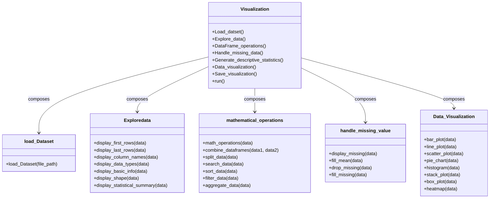
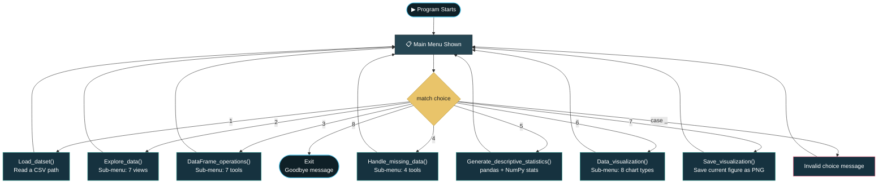

<div align="center">

```
███████╗ █████╗ ██╗     ███████╗███████╗
██╔════╝██╔══██╗██║     ██╔════╝██╔════╝
███████╗███████║██║     █████╗  ███████╗
╚════██║██╔══██║██║     ██╔══╝  ╚════██║
███████║██║  ██║███████╗███████╗███████║
╚══════╝╚═╝  ╚═╝╚══════╝╚══════╝╚══════╝

██╗   ██╗██╗███████╗██╗   ██╗ █████╗ ██╗     ██╗███████╗███████╗██████╗
██║   ██║██║██╔════╝██║   ██║██╔══██╗██║     ██║╚══███╔╝██╔════╝██╔══██╗
██║   ██║██║███████╗██║   ██║███████║██║     ██║  ███╔╝ █████╗  ██████╔╝
╚██╗ ██╔╝██║╚════██║██║   ██║██╔══██║██║     ██║ ███╔╝  ██╔══╝  ██╔══██╗
 ╚████╔╝ ██║███████║╚██████╔╝██║  ██║███████╗██║███████╗███████╗██║  ██║
  ╚═══╝  ╚═╝╚══════╝ ╚═════╝ ╚═╝  ╚═╝╚══════╝╚═╝╚══════╝╚══════╝╚═╝  ╚═╝
```

[](https://git.io/typing-svg)


</div>

## 🧭 Table of Contents

[Overview](#-project-overview) • [Objective](#-objective) • [Package Design](#-package-design) • [Module Breakdown](#-module-breakdown) • [Features](#-features) • [Program Flow](#-program-flow) • [Example Output](#-example-output) • [Video](#-Video) • [Skills Demonstrated](#-skills-demonstrated) • [Known Behaviors](#-known-behaviors--notes) • [Getting Started](#-getting-started) • [Project Structure](#-project-structure) • [Tech Stack](#-tech-stack)

---

## 📌 Project Overview

**Sales Data Analysis & Visualization** is a menu-driven Python console application built around **pandas**, **NumPy**, **Matplotlib**, and **Seaborn**. It loads a CSV dataset and walks you through **exploration**, **DataFrame operations**, **missing-value handling**, **descriptive statistics**, and **8 chart types** — all behind one unified `Visualization` interface. Each concern lives in its own class inside a dedicated `pandas_datavisulization/` package, and the entry-point script simply composes them together and routes user input via nested `match` / `case` menus.

<div align="center">

| 📂 Load | 🔍 Explore | 🧮 Operate | 🩹 Clean | 📊 Statistics | 🎨 Visualize |
|:---:|:---:|:---:|:---:|:---:|:---:|
| Read a CSV | Head/tail/dtypes/shape | Combine, split, search, sort, filter, aggregate | Detect & fix missing values | Pandas + NumPy descriptive stats | 8 Matplotlib/Seaborn chart types |

</div>

> Built as a **pandas + data-visualization practice project.**
> *"Load once, analyze every which way."*

---

## 🎯 Objective

Provide a single console entry point that composes several small, focused classes — one per data-analysis theme (loading, exploring, transforming, cleaning, aggregating, and plotting) — and exposes them through a consistent, nested menu system, all working off of one loaded dataset.

Concepts demonstrated:

- **Object composition** — `Visualization` doesn't inherit from its five helper classes, it *holds* an instance of each and delegates to them, passing the shared `self.data` DataFrame into every call
- **Package structure** — each utility is its own module inside `pandas_datavisulization/`, re-exported through `__init__.py` for clean imports
- **pandas + NumPy fundamentals** — `read_csv`, `head`/`tail`, `dtypes`, `describe`, boolean filtering, `sort_values`, `concat`, and NumPy reducers (`sum`, `mean`, `std`, `var`, `min`, `max`)
- **Matplotlib & Seaborn** — bar, line, scatter, pie, histogram, stack plot, box plot, and a correlation heatmap
- **Nested menu-driven UI** — a top-level menu that drops into sub-menus, each wrapped in its own `while True` loop, built with `match` / `case`
- **Exception handling** — dataset loading guards against `FileNotFoundError`, `EmptyDataError`, and `OSError`; every menu loop guards its `input()` against `EOFError` and `ValueError`

---

## 🧱 Package Design



`Visualization` is a **facade**: it instantiates one object of each utility class in `__init__`, keeps the loaded DataFrame in `self.data`, and exposes a wrapper method per menu section that simply passes `self.data` into the right helper — none of the five utility classes know about each other or about `Visualization` itself.

---

## 🧩 Module Breakdown

| Module | Class | Responsibility |
|---|---|---|
| `loadDataset.py` | `load_Dataset` | Reads a CSV into a DataFrame, guarding against missing/empty/unreadable files |
| `Exploredata.py` | `Exploredata` | Head, tail, column names, dtypes, `info()`, shape, and `describe()` |
| `performoperation.py` | `mathematical_operations` | Sum/mean/max/min, concatenation, threshold splitting, exact-match search, ascending/descending sort, threshold filtering, and full aggregation |
| `Handlemissingvalue.py` | `handle_missing_value` | Reports missing values, fills numeric NaNs with the mean, drops incomplete rows, or fills every column (mean for numeric, mode for text) |
| `data_visualization.py` | `Data_Visualization` | Bar, line, scatter, pie, histogram, stack plot, Seaborn box plot, and a correlation heatmap |
| `__init__.py` | — | Re-exports all five classes so `pandas_visulization.py` can do a single-line import per class |
| `pandas_visulization.py` | `Visualization` | Entry point — facade class + top-level menu routing |

---

## ✨ Features

**📂 Load Dataset**
- Load any CSV file by path into a working DataFrame held for the rest of the session

**🔍 Explore Data**
- First/last 5 rows, column names, data types, `info()` summary, shape, and a full statistical summary (`describe()`)

**🧮 DataFrame Operations**
- **Math**: total, average, maximum, and minimum `Sales`
- **Combine**: load a second CSV and concatenate it with the current dataset
- **Split**: break the dataset into high-sales (`> 50,000`) and low-sales (`≤ 50,000`) views
- **Search**: find every row matching an exact `Product` name
- **Sort**: by `Sales`, ascending or descending
- **Filter**: keep only rows at or above a given `Sales` threshold
- **Aggregate**: total, average, count, maximum, and minimum `Sales` in one view

**🩹 Handle Missing Data**
- Show a per-column count of missing values
- Fill numeric NaNs with the column mean
- Drop every row containing a missing value
- Fill *all* columns — mean for numeric columns, mode for text columns

**📊 Generate Descriptive Statistics**
- Sum, mean, median, standard deviation, variance, min, max, and the 25th/50th/75th percentiles of `Sales` via pandas
- The same sum/mean/median/std/var/min/max recomputed independently via NumPy for comparison

**🎨 Data Visualization**
- **Bar**, **line**, and **scatter** plots between two chosen columns
- **Pie chart** and **histogram** for a single column
- **Stack plot** across one X column and two Y columns
- **Seaborn box plot** for a single column
- **Seaborn heatmap** of the correlation matrix across all numeric columns

**💾 Save Visualization**
- Save the most recently shown Matplotlib figure to a `.png` file (auto-appends the extension if omitted)

**🧭 Navigation**
- Every sub-menu has its own "Back to Main Menu" option
- Dataset-dependent menus check `self.data` first and prompt you to load a dataset if it's missing

---

## 🌊 Program Flow



| Step | Stage | Description |
|:---:|---|---|
| 1 | **Show Main Menu** | Print the eight top-level options |
| 2 | **Take Choice** | Read the user's number and route it via `match choice:` |
| 3 | **Enter Sub-Menu** | Options 2, 3, 4, and 6 open their own looping sub-menu with a "back to main menu" exit |
| 4 | **Run Operation** | The chosen helper class method executes against `self.data` and prints/plots its result |
| 5 | **Repeat** | Control returns to the main menu until the user chooses to exit |

---

## 🎬 Example Output

<details open>
<summary><b>▶ Load a dataset and explore it</b></summary>

```
Please select an option:
1. Load Dataset
2. Explore Data
3. Perform DataFrame Operations
4. Handle Missing Data
5. Generate Descriptive Statistics
6. Data Visualization
7. Save Visualization
8. Exit

Enter Your Choice (1-8): 1
========================== Load Dataset ==========================
Enter the path of the dataset (CSV File): sales_data.csv
Dataset loaded successfully.

Enter Your Choice (1-8): 2
========================== Explore Data ==========================
1. Display the first 5 Rows
2. Display the last 5 Rows
3. Display column names
...
Enter YOur Choice (1-8): 6
Dataset Shape:
(500, 6)
```

</details>

<details open>
<summary><b>▶ Aggregate sales data</b></summary>

```
Enter YOur Choice (1-8): 7
========================== Aggregate Data ==========================
Total Sales       : 2847500
Average Sales     : 56950.0
Count of Sales     : 50
Maximum Sales     : 98200
Minimum Sales     : 12300
```

</details>

---

## Video

Link : https://drive.google.com/drive/folders/1AkdUp-K59YzhWiVjmzQBSpV7MKLd22bC?usp=sharing

---

## 🎯 Skills Demonstrated

<div align="center">


</div>

- Composing multiple independent classes behind a single facade class that shares one DataFrame
- Organizing related functionality into an importable package with `__init__.py`
- Practical use of `pandas` (I/O, exploration, cleaning, aggregation) alongside NumPy reducers
- Building 8 distinct chart types with Matplotlib and Seaborn, each guarded by a column-existence check
- Nested, loopable menu systems built with `match` / `case`, guarded against `EOFError` / `ValueError`

---

## 📝 Known Behaviors & Notes

A few honest notes for anyone reading or extending this code:

- **The empty-dataset guard never fires:** `Explore_data()`, `DataFrame_operations()`, and `Handle_missing_data()` all check `if len(self.data) < 0`, but a length can never be negative — the check is dead code that was likely meant to be `== 0`.
- **Descriptive statistics skip the "no dataset loaded" check:** unlike the other menu options, `Generate_descriptive_statistics()` doesn't verify `self.data` is set first, so choosing it before loading a CSV raises an uncaught `AttributeError`.
- **A bad choice at the main menu quits the whole program:** `run()`'s `except EOFError` / `except ValueError` blocks call `return`, which ends `run()` itself — so a non-numeric entry at the *top-level* menu silently exits the program (no goodbye message), whereas the same mistake inside any sub-menu just returns you to the main menu.
- **`display_basic_info()` prints an extra `None`:** `data.info()` already prints its summary and returns `None`, so wrapping it in `print(data.info())` prints the info block and then prints `None` right after it.
- **Combined DataFrames aren't kept:** `DataFrame_operations()`'s "Combine DataFrames" option prints the concatenated result but never assigns it back to `self.data`, so the merge doesn't persist for later steps in the session.
- **`math_operations()` and `aggregate_data()` overlap:** both compute total/average/max/min `Sales`; aggregate only adds a count on top, making the two menu options largely redundant.
- **`filter_data()`'s threshold input isn't guarded:** `int(input("Enter minimum sales value: "))` has no `try`/`except`, so a non-numeric entry crashes that operation.
- **`box_plot()` sets `hue` to the same column as `x`:** `sns.boxplot(x=data[column], hue=data[column])` draws a legend that just repeats the x-axis categories.
- **All DataFrame tools are hardcoded to `Sales`/`Product`:** despite loading any CSV, every operation in `performoperation.py` and `Generate_descriptive_statistics()` assumes those exact column names, so the toolkit only works end-to-end on datasets with that schema.
- **"Save Visualization" depends on the figure still being open:** every plot method ends with `plt.show()`, so depending on the Matplotlib backend the figure may already be cleared by the time you choose "Save Visualization" afterward.

---

## 🚀 Getting Started

### Prerequisites

- Python 3.10+ (for `match` / `case` support)
- [pandas](https://pandas.pydata.org/), [NumPy](https://numpy.org/), [Matplotlib](https://matplotlib.org/), and [Seaborn](https://seaborn.pydata.org/)

### Installation

```bash
git clone https://github.com/<your-username>/pandas-sales-visualizer.git
cd pandas-sales-visualizer
pip install pandas numpy matplotlib seaborn
```

### Usage

```bash
python pandas_visulization.py
```

When it runs, choose from the main menu:
- `1` — Load Dataset
- `2` — Explore Data
- `3` — Perform DataFrame Operations
- `4` — Handle Missing Data
- `5` — Generate Descriptive Statistics
- `6` — Data Visualization
- `7` — Save Visualization
- `8` — Exit

> 💡 The DataFrame and statistics tools expect a `Sales` column (and `Product` for search) — point the loader at a CSV with that schema for the full feature set to work.

---

## 📁 Project Structure

```
pandas-sales-visualizer/
├── pandas_visulization.py          # Entry point — Visualization facade + menu routing
├── pandas_datavisulization/
│   ├── __init__.py                 # Re-exports all five utility classes
│   ├── loadDataset.py              # load_Dataset
│   ├── Exploredata.py              # Exploredata
│   ├── performoperation.py         # mathematical_operations
│   ├── Handlemissingvalue.py       # handle_missing_value
│   └── data_visualization.py       # Data_Visualization
└── README.md                       # Project documentation
```

> `__pycache__/*.pyc` compiled bytecode files are generated automatically by Python and are safe to delete or add to `.gitignore` — they aren't part of the source.

---

## 🛠️ Tech Stack

- **Language:** Python 3
- **Libraries:** pandas, NumPy, Matplotlib, Seaborn
- **Concepts demonstrated:** OOP composition, package/module design, CSV I/O, data exploration & cleaning, DataFrame transformations, descriptive statistics, data visualization, `match`/`case` menu-driven CLI design
